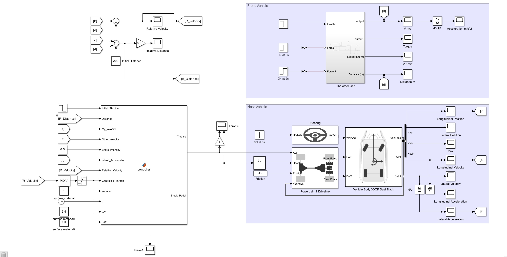

# Adaptive Cruise Control System Using MATLAB/Simulink

This project presents a MATLAB/Simulink-based Adaptive Cruise Control (ACC) system for intelligent vehicle speed regulation and safe-distance maintenance.

The system simulates both host and front vehicles and dynamically adjusts throttle and braking based on:

- Relative distance
- Relative velocity
- Surface condition
- Lateral acceleration
- Obstacle detection

The model integrates vehicle dynamics, braking logic, sensor modelling, and closed-loop control within a complete simulation environment.

## Main Features

- Adaptive Cruise Control (ACC)
- Vehicle dynamics simulation
- Surface-aware braking control
- Relative distance and velocity monitoring
- Automatic throttle and braking logic
- Obstacle detection system
- Road trajectory simulation
- Closed-loop Simulink implementation

## System Architecture

## Technologies Used

- MATLAB
- Simulink
- Vehicle Dynamics Blockset
- PID Control
- Sensor Modelling

## Published Paper

Related publication:

https://ajme.aut.ac.ir/article_5450_21d10ef9bec5a0aa78f9bb6836e9616c.pdf
